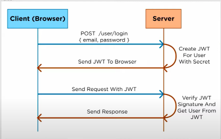

# JSON Web Tokens (JWT)

## Authentication vs Authorization:

Authentication:

- The process of verifying a user’s identification through the acquisition of credentials and using those credentials to confirm the user’s identity. Typically done through gathering a username and password from a user and comparing them with stored credentials.

Authorization:

- The process of allowing authenticated users access to resources by determining whether they have system access permissions.

JWTs' provide a form of authorization. When a user logs into a website, the site will generate a JWT that contains information about the user. This info is then stored client side. Now, the client can send requests using this ADD CONTENT

---

JWT’s are composed of a header, payload, and signature. Each section is separated by a period. When encoded, have the following structure: xxxxx.yyyyy.zzzzz

All three sections are base64url strings.

## Header

The header is typically comprised of the hash method used in the signature section of the JWT as well as the type of token (JWT).

Example:
{
"alg": "HS256",
"typ": "JWT"
}

## Payload

The payload consists of claims AKA statements about an entity (typically, the user). These claims can come in 3 types:

- Registered Claims

  Claims that are predefined by JWT and are recommended, but not required (typically to allow interpolation with third party applications). Some examples of these registered claims are...

  - iss (issuer): Issuer of the JWT
  - sub (subject): Subject of the JWT (the user)
  - aud (audience): Recipient for which the JWT is intended
  - exp (expiration time): Time after which the JWT expires
  - nbf (not before time): Time before which the JWT must not be accepted for processing
  - iat (issued at time): Time at which the JWT was issued; can be used to determine age of the JWT
  - jti (JWT ID): Unique identifier; can be used to prevent the JWT from being replayed (allows a token to be used only once)

- Custom Claims:

  Claims that are determined and designed by the developer sending the JWT, containing generic information like name and email.

  - Public Claims:
    Collision-resistant names defined universally and used for public consumption.

  - Private Claims:
    Claims that are known only to the producer and consumer of a JWT. Private claim names are not collision-resistant and should be used with clear understanding of this and care

## Signature

To generate the JWT signature:

- base64encode your header
- base64encode your payload
- combine the two with a period between them
- hash them using a 256 bit secret

## The Full JWT

The entire JWT will be the following:
`{encoded header}.{encoded payload}.{signature}`

## Resources

[Video on JWTs](https://www.youtube.com/watch?v=7Q17ubqLfaM)
